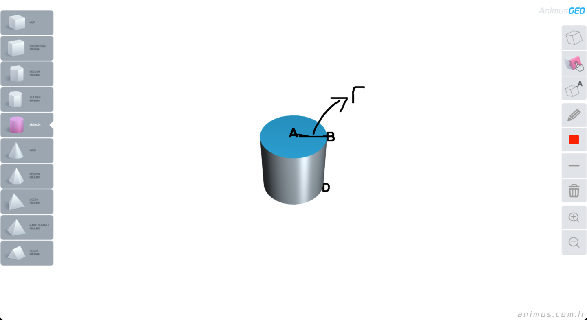

# Geometry Painter

Geometry Painter is designed to be used on smart boards in the classrooms.

You can try it yourself at https://mkadirtan.github.io/GeometryPainter

## Features

- Touch control
- Pen with adjustable color and thickness
- Zoom In / Zoom Out and freely rotate the camera
- 10 geometrical objects including cyclinder, cone and prisms.
- Toggle capital letters on the corners of objects
- Paint object faces in different colors

## Development

To install dependencies

`npm install`

To start the project at localhost:8080

`npm run dev`

To build the project

`npm run build`

## Disclaimer

The product and the digital material is designed by Haydar Aydoğdu, and he hired me for writing the software.

This project is published with the approval of Haydar Aydoğdu.

As stated in the LICENSE, you may use and redistribute the source code and materials. But, you need to give attribution, and you must re-distribute modified source code and designs under the same LICENSE.